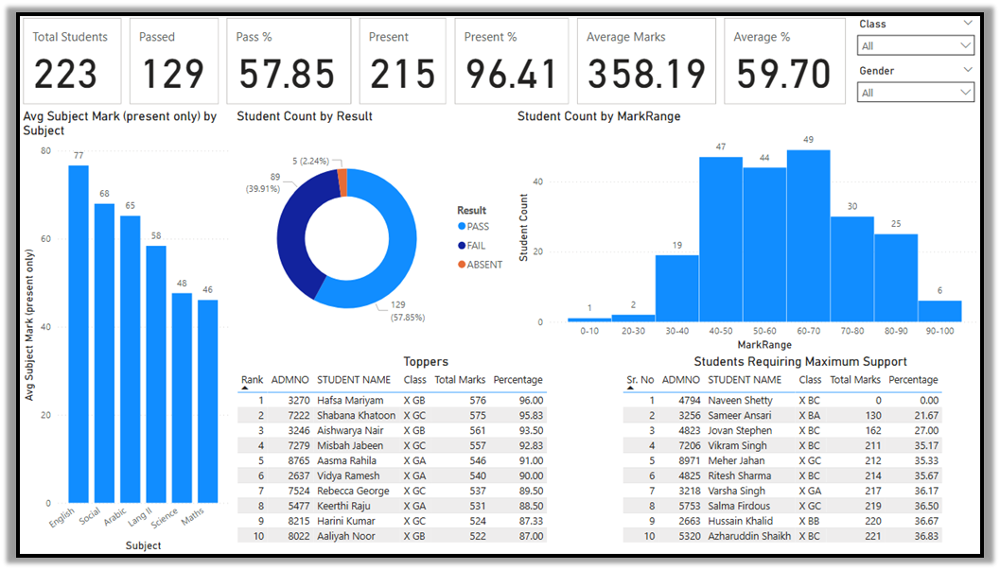
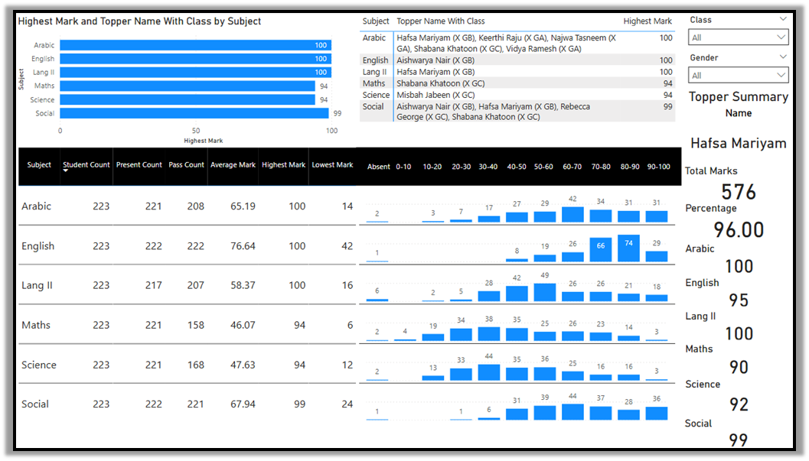

# 📘 Student-Result-Analysis-PowerBI
This repository contains a fully interactive Power BI dashboard for analyzing student performance across multiple subjects. The project includes Excel source data, DAX measures, KPIs, subject-wise insights, mark range distributions, toppers identification, and complete documentation. All visuals and screenshots are provided for easy understanding and replication.

---

## 📊 Dashboard Preview

### **Main Dashboard**

### **Subject-wise Analysis**

### **Consolidated Report**

---

## 🗂 Project Files Included

| File | Purpose |
|------|---------|
| **Result_Analysis.pbix** | Main Power BI dashboard file |
| **Students_Marks.xlsx** | Input dataset used for modeling & visualization |
| **Screenshot.pdf** | PDF export of main dashboard pages |
| **Steps of the entire Project.pdf** | Full documentation of the work process |
| **Picture1.png** | Dashboard screenshot |
| **Picture2.png** | Subject-wise page screenshot |
| **Picture3.png** | Consolidated Report screenshot |

---

## 🚀 Features & Highlights

### 🔹 **1. Overall Student KPIs**
- Total Students  
- Present & Pass Count  
- Present & Pass %  
- Average MArks
- Average %  
- Highest & Lowest Scores  
- Top 10 Students  
- Bottom 10 Students  

### 🔹 **2. Subject-wise Insights**
- Present Count  
- Pass Count  
- Average Mark  
- Highest / Lowest Mark  
- Mark Range Distribution (0–10, 10–20 ... 90–100)  
- Subject toppers  

### 🔹 **3. Consolidated Report**  
- Marks scored in all 6 subjects (Arabic, English, Lang II, Maths, Science, Social)
- Column for Total Marks, Percentage, Class, Reslut & No. of Subjects Failed
- Slicers available for Class, Gender, Result, Subject and Mark Range (Absent, 0–10, 10–20 ... 90–100) 
---

## 🛠 Tech Stack

- **Power BI Desktop**
- **DAX (Data Analysis Expressions)**
- **Excel**
- **Data Modeling (Normalization & Unpivoting)**
- **GitHub Project Hosting**

---

## 📂 Folder Structure
/
├── Result_Analysis.pbix
├── Students_Marks.xlsx
├── Screenshot.pdf
├── Steps of the entire Project.pdf
├── Picture1.png
├── Picture2.png
├── Picture3.png
└── README.md

---

📥 How to Use

- Download the repository.
- Open Result_Analysis.pbix in Power BI Desktop.
- Ensure dataset path points to Students_Marks.xlsx.
- Refresh the data.
- Explore interactive dashboards.

---

## ⭐ If you find this project helpful, consider giving the repository a star!
